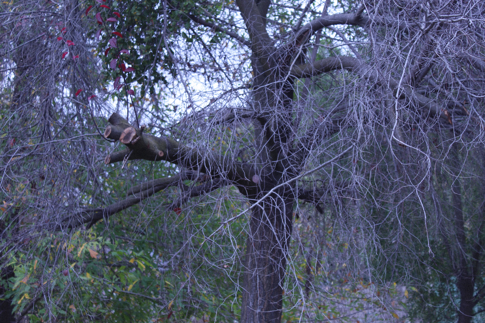
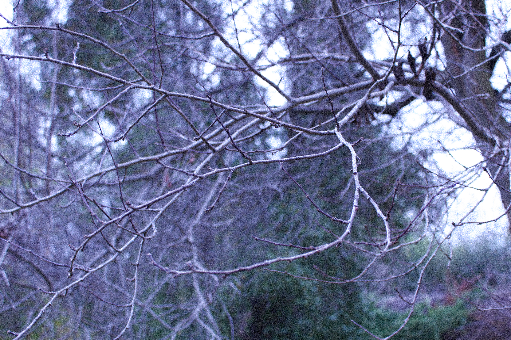
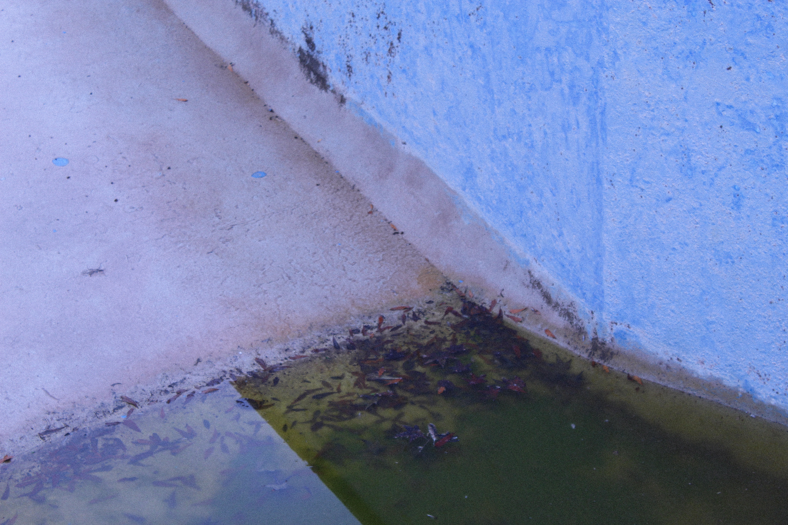

## Mis poemas de invierno

#### Lunes 22 de junio, invierno 2026

Cada decisión me parece intrascendente,

siento este invierno azul,

extenuante;

cada decisión,

y yo sola,

en este incomprensible invierno;

cada decisión,

borraste todos los colores.

#### Jueves 25 de junio, invierno 2026

En esta temporada,

habito un viacrucis,

sepúltenme,

en mi camino de devoción;

sepúltenme entre retoños.

#### Domingo 28 de junio, invierno 2026

Hazme parte de cada fractal que conforma mi reflejo,

hazme parte,

fúndamentame.

#### Lunes 29 de junio, invierno 2026

Nunca desperté,

recorro laberintos,

entro por una y otra puerta,

cada vez más adentro,

y no logro conciliar esta certidumbre.

#### Domingo 05 de julio, invierno 2026

Mi secreto:

Son pulsiones,

son suspiros,

son colores,

cada día, y el anterior, en la mañana.

#### Jueves 16 de julio, invierno 2026

Nunca formaré parte de lo mismo,

este propósito,

me aglomero a esto,

una suerte de yo,

a esto;

ya no recuerdo el engaño,

no comprendí esta sentencia,

me incrusté entre la aspereza.

#### Sábado 18 de julio, invierno 2026

Mi madre me preguntó por qué no reaccionaba;

mi estado feroz,

está sumido.

#### Domingo 19 de julio, invierno 2026

Siento este engaño,

no quiero pensar significancias,

no creí que te correspondieran,

no creí.

Se consume el aire en el desconocimiento,

tu recuerdo es una ternura que va a acabar con mi quehacer.

#### Martes 21 de julio, invierno 2026

Estas ideas devastadoras,

me inmovilizan,

para no tener que hacerme cargo de esta vida.

#### Martes 28 de julio, invierno 2026

Siento el apuro de hacer mis palabras más pequeñas,

existen en la limerencia;

desde esta ingenuidad

en la que te gustaba habitarme.

#### Viernes 31 de julio, invierno 2026

Como si lo hubieras escogido,

hoy todo me parece hostil,

se pronuncian punzantes,

como si lo hubieras escogido;

si todo se tratara de mí,

vivirías de la certeza,

en el lecho de mis ideas.

#### Sábado 01 de agosto, invierno 2026

Debo repetir mis temas a ver si en mis palabras encuentro la concepción;

debo repetir los temas 

a ver si en las palabras encuentro,

si en las palabras te encuentro,

si te descifro,

si descifro esto.

Debo descifrar las palabras,

los vestigios de lo que fueron tus ideas

con las que soñaste,

a ver si en tus sueños me encuentro;

puedo soportar ser solo parte de tus sueños,

debo repetir los sueños

hasta que dejen de dolerme,

porque no hay nada más que descifrar,

ya indagué cada palabra,

y no logro encontrarme en esta repetición.

#### Domingo 02 de agosto, invierno 2026

Podría dejar de ser parte incluso de todo,

y nadie extrañaría mis ademanes,

mis respuestas sensatas y ridículas,

mis abrazos y mis besitos.

En este intento de permanecer,

me doy cuenta de que nunca soy suficientemente parte de algo.

Siempre estoy en la excepción,

la consulta,

el dilema.

En este intento de permanecer,

he construido un universo en donde hundirme,

para que puedan recorrerme,

cuando me sumerja por completo.

#### Miércoles 12 de agosto, invierno 2026

quería aferrarme a algo,

aunque sea a este invierno que me inmoviliza,

por supuesto que fue a lo incorrecto,

soy incapaz, 

fui;

quiero detenerme en la excepción,

y en cada gesto que estaba colmado de indecisión.

#### Miércoles 12 de agosto, invierno 2026

**Hasta que no sea yo**

cambiaría cada palabra que escogí,

ocultaría cada miedo,

dejaría de comunicar mis ideas con soltura,

escondería cada acto de amor

que denote lo mucho que quería estar a tu lado.

#### Jueves 13 de agosto, invierno 2026

Me gustaría envolverme en una arboleda,

quiero que mis ideas se enmarañen sobre mí;

si me vieran enraizada, no cuestionarían en dónde me hallo.

#### Domingo 16 de agosto, invierno 2026

Entiendo que no tenga que arrastrarte a esto,

pero incluso ahí, no serías capaz de entenderme;

me gusta recostarme a tu lado,

hay una pequeña parte de mí que cree que podríamos compartir nuestras vidas,

pero eres alguien despreocupado, en el mejor de los sentidos,

y yo soy alguien que se siente cómoda habitando mis complejidades.
